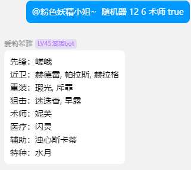

肉鸽随机器是一个明日方舟的自动抽卡机器人插件，使用Python编写，用于草籽杯抽卡。

<!-- more -->

## 使用方法

需```@```bot，然后输入```随机器```即可。

## 功能

可随机抽取指定数量指定稀有度指定职业指的干员，并且可以设置保底。
> 默认参数为随机12个六星干员

## 可选参数

随机器 ```[数量]``` ```[星级]``` ```[职业]``` ```[保底]```
> 参数之间空格隔开

- 数量：抽取的干员数量，默认12

- 星级：抽取的干员星级，默认六星

- 职业：抽取的干员职业，默认所有职业

- 保底：每个职业至少一名干员
  - 抽取数量不得低于职业数量
  - 单个职业内至少分得一名干员

## 示例

```(text)
@bot 随机器 12 6 术师 true
```



## 注意事项

- 输入参数可以缺省乱序，但是数量必须在稀有度之前
- 保底参数为true或false，不区分大小写
- 目前只支持单个职业单个稀有度随机
